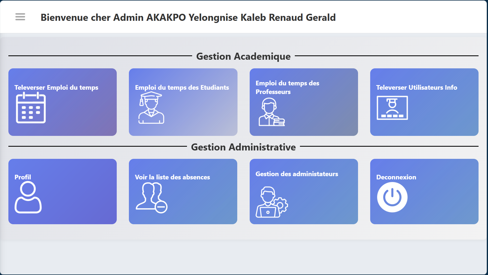
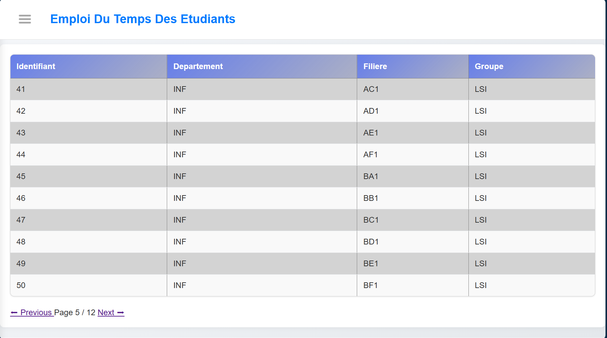
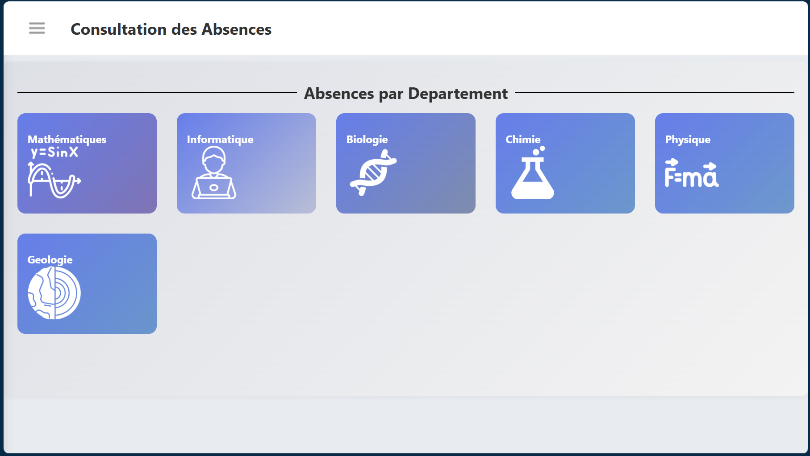

# Timetable Management System
## Description
A web application built with Spring Boot, Thymeleaf, 
HTML, and CSS for managing and displaying student 
timetables in a structured and user-friendly 
interface

## Purpose of The Application
Design and Develop a web-based system that helps 
students and administrators efficiently create, 
manage, and view academic timetables in 
a structured and accessible way.

## Class Diagram

## Technologies
- Spring Boot
- Thymeleaf
- HTML
- CSS
- PostgreSQL
- Hibernate
- Spring Data JPA 
- Spring Security 
- Apache POI ( Excel Handling)

## Features

- Secure authentication system using Spring Security
- Role-based access control (Admin / User)
- Full CRUD operations for timetable management
- Dynamic timetable display with Thymeleaf templates
- Clean and responsive UI using HTML and CSS
- Import Students and Teachers Data to get them 
have access to the system
- Import and Manage all Timetables as an Admin
- See your timetable and profile as a teacher or a student

## Security

- Authentication implemented using Spring Security
- Role-based access (ADMIN / USER)
- Passwords are encrypted using BCrypt

## Screenshots 
### Dashboard

### Timetable List

### Timetable Send

### Field

### See absences

## Configuration

This project uses environment variables for sensitive configuration.

### Environment Variables

- DB_URL: JDBC URL of PostgreSQL database
- DB_USERNAME: Database username
- DB_PASSWORD: Database password

### Example (PowerShell)

$env:DB_URL="jdbc:postgresql://localhost:5432/schedule_db"
$env:DB_USERNAME="postgres"
$env:DB_PASSWORD="your_password"

### Application Properties

spring.datasource.url=${DB_URL}
spring.datasource.username=${DB_USERNAME}
spring.datasource.password=${DB_PASSWORD}

### Requirements

- Java 17+
- Maven
- PostgreSQL database running locally

## Setup
1. Cloner le projet
- git clone https://github.com/ton-user/ton-projet.git

2. Aller dans le dossier
- cd scheduleTimetable

3. Lancer avec Maven
- ./mvnw spring-boot:run

## How to Run
1. Start PostgreSQL
2. Set environment variables
3. Run the application:
- ./mvnw spring-boot:run
## Usage
- Go to: http://localhost:8080
- Login as admin or user
- Import or view your timetable

## Project Structure 

### src/main/java/com/belak/scheduletimetable

- configuration → Application configuration (beans, CORS, etc.)
- controller → MVC controllers (Thymeleaf pages)
- restcontroller → REST API endpoints
- service → Business logic layer
- repository → Database access layer (JPA repositories)
- model → JPA entities (database tables mapping)
- dto → Data Transfer Objects
- request → Request payload classes
- response → Response payload classes
- enumeration → Enum definitions used across the application
- exception → Custom exceptions + global exception handling
- security → Spring Security configuration and filters
- data → Data initialization / seeders
- record → Java records (immutable data structures)

### src/main/resources

- templates → Thymeleaf HTML views (frontend)
- static → Static assets (CSS, images)
- application.properties → Main configuration file
## Author
- Kaleb AKAKPO
- GitHub: https://github.com/Belak17

