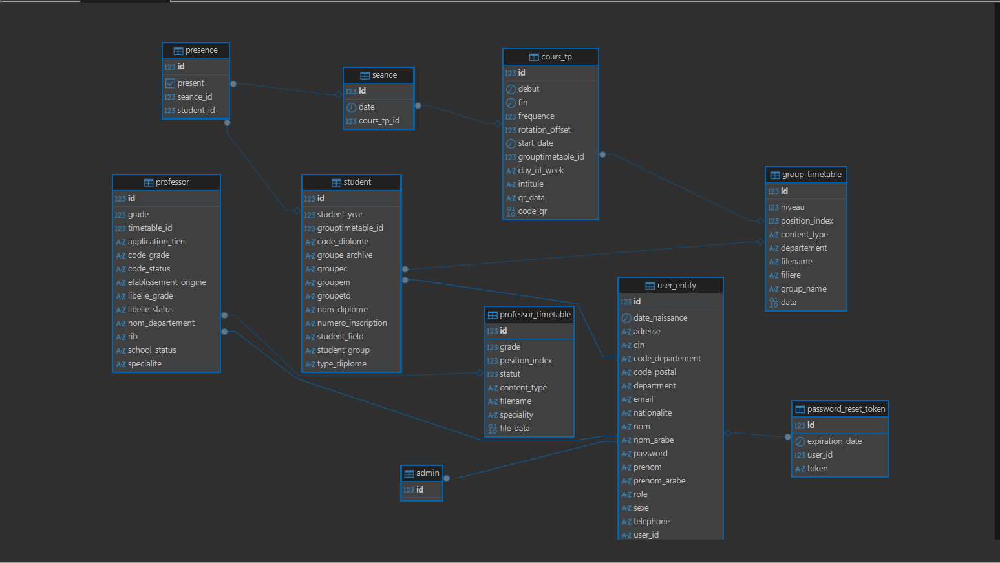
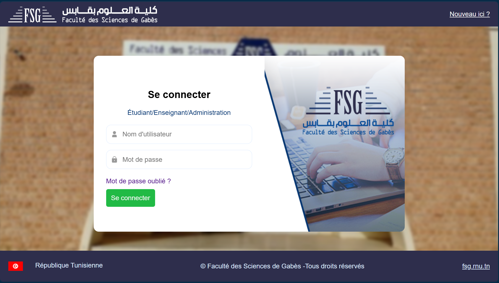
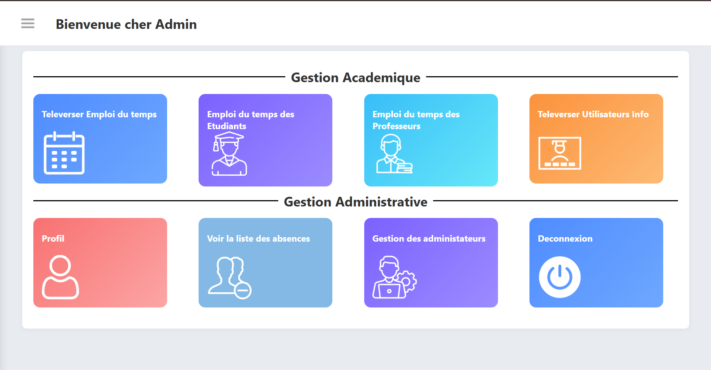
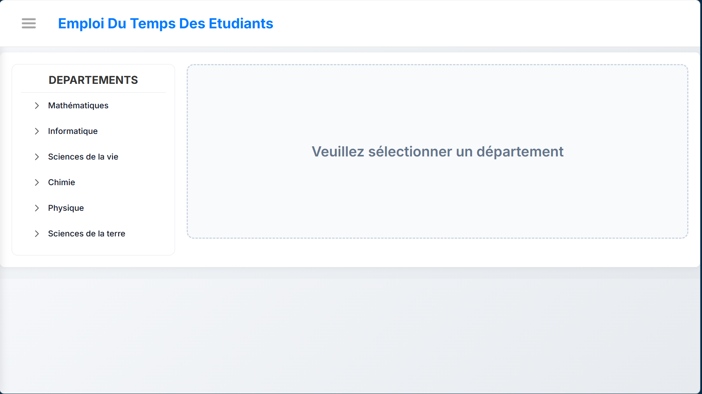
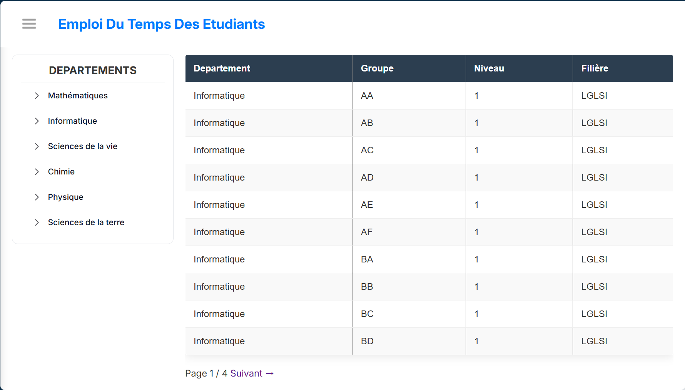
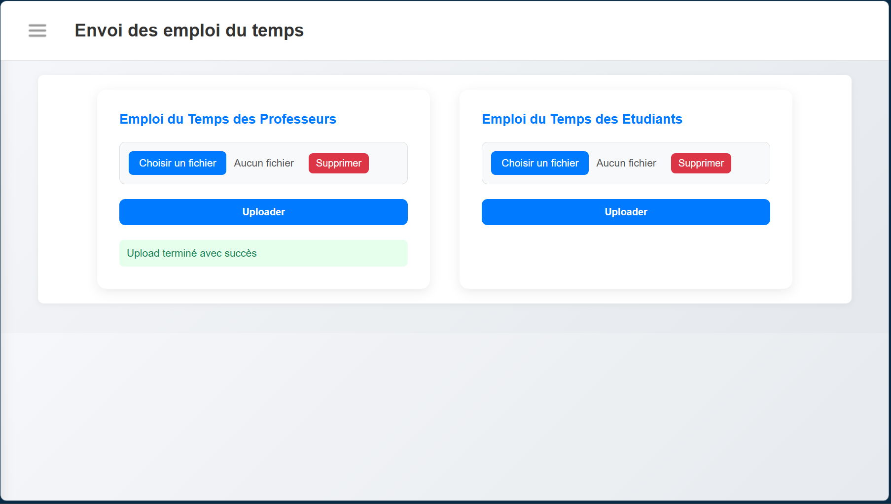
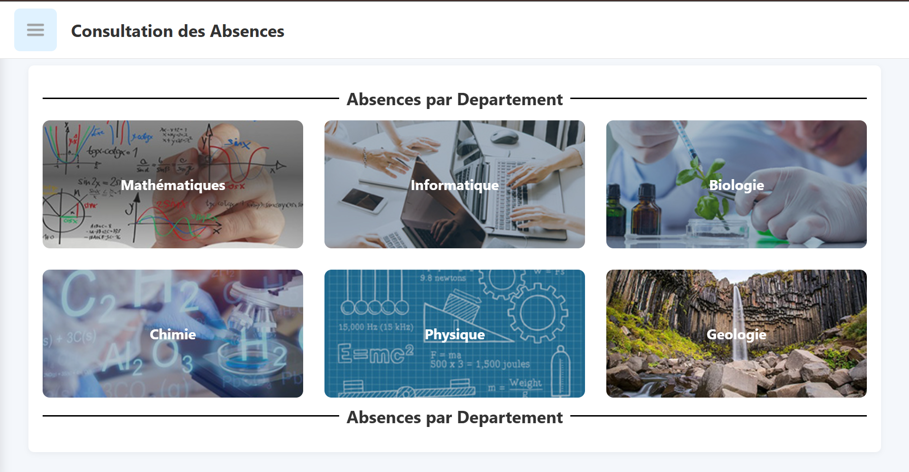
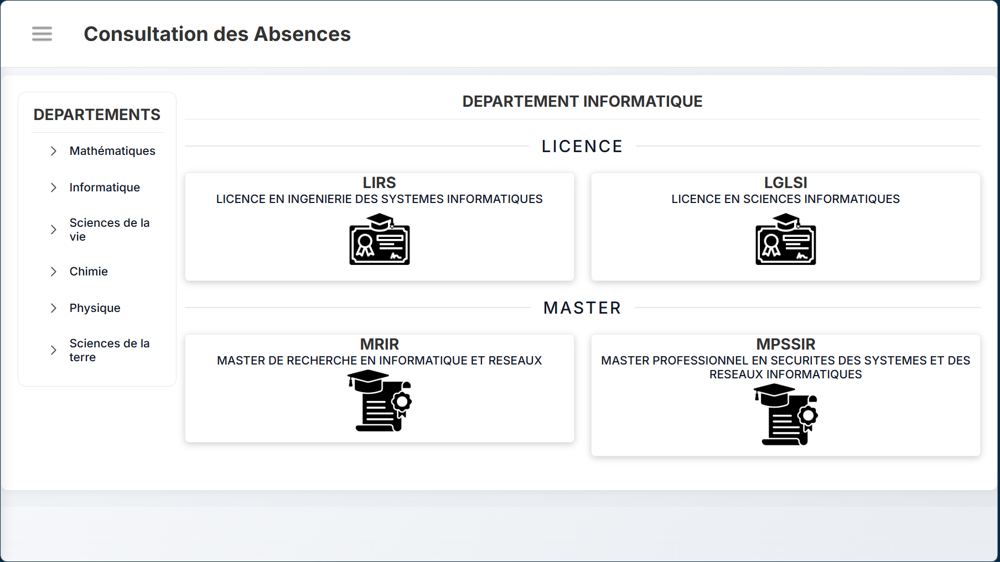
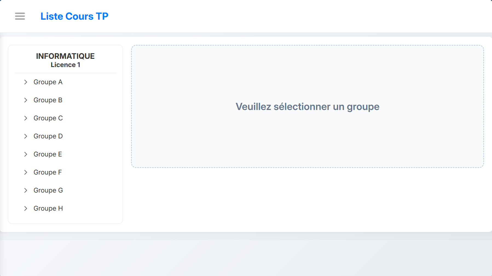
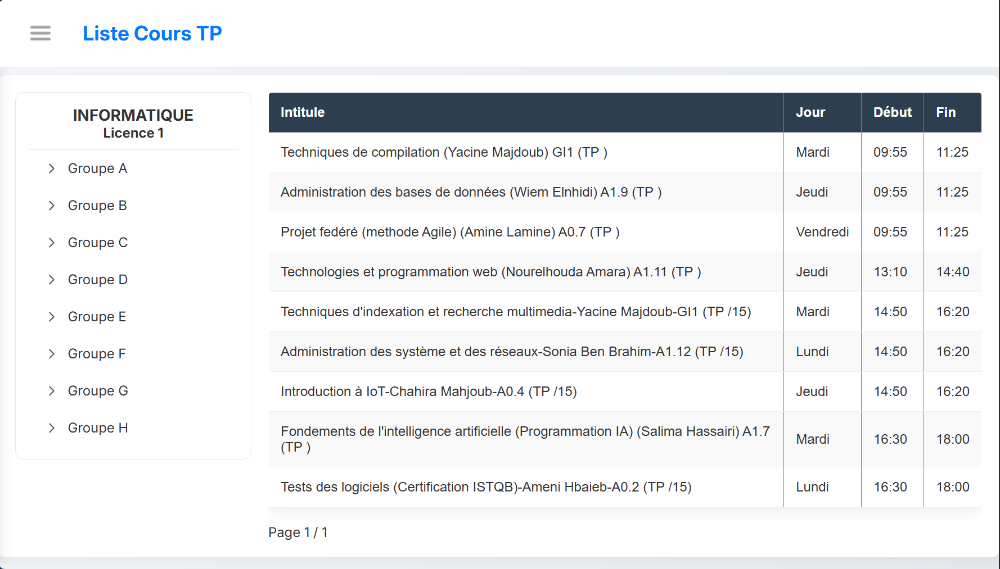

#  Timetable Management System

[](https://www.java.com/)
[](https://spring.io/projects/spring-boot)
[](https://www.thymeleaf.org/)
[](https://www.postgresql.org/)
[](https://spring.io/projects/spring-security)

> A web application built with Spring Boot and Thymeleaf for managing academic timetables with secure authentication, timetable importation, and role-based access control.

---

#  Table of Contents

- [About](#about)
- [Purpose](#purpose)
- [Features](#features)
- [Security](#security)
- [Technologies](#technologies)
- [Architecture](#architecture)
- [Class Diagram](#class-diagram)
- [Screenshots](#screenshots)
- [Configuration](#configuration)
- [Installation](#installation)
- [Usage](#usage)
- [Project Structure](#project-structure)
- [Future Improvements](#future-improvements)
- [Author](#author)

---

#  About

Timetable Management System is a web-based platform designed to simplify the management and visualization of academic timetables.

The application allows administrators, teachers, and students to interact with schedules through a secure and intuitive interface.

It was developed using **Spring Boot**, **Thymeleaf**, and **PostgreSQL**, following a clean layered architecture.

---

#  Purpose

The main goal of this application is to provide an efficient solution for:

-  Creating academic timetables
-  Managing schedules dynamically
-  Handling teachers and students access
-  Importing timetable data
-  Viewing timetables in a structured way

The system improves accessibility and organization for both students and administrators.

---

#  Features

##  Authentication & Security
- Secure login system with Spring Security
- Role-based access control (**ADMIN / USER**)
- Password encryption using BCrypt

##  Timetable Management
- Full CRUD operations for timetable management
- Dynamic timetable rendering using Thymeleaf
- Department-based timetable visualization
- Timetable sending and importation

##  User Management
- Import students and teachers data
- Manage user access to the system
- Personalized timetable view for students and teachers

##  User Interface
- Responsive UI using HTML & CSS
- Structured and clean interface
- Dashboard for administrators and users

##  Excel Importation
- Excel file handling using Apache POI
- Import timetable data efficiently

---

#  Security

The application integrates **Spring Security** for authentication and authorization.

### Security Features

- Authentication system using Spring Security
- BCrypt password hashing
- Role-based access control (**ADMIN / USER**)
- Protected routes and restricted operations

---

#  Technologies

## Backend
- **Java 17**
- **Spring Boot**
- **Spring Security**
- **Spring Data JPA**
- **Hibernate**

## Frontend
- **Thymeleaf**
- **HTML**
- **CSS**

## Database
- **PostgreSQL**

## File Handling
- **Apache POI** (Excel import/export)

## Development Tools
- **Maven**
- **Git & GitHub**
- **IntelliJ IDEA / Eclipse**

---

#  Architecture

The project follows a layered architecture.

```text
┌────────────────────┐
│   Presentation     │ → Thymeleaf + HTML/CSS
└─────────┬──────────┘
          │
          ▼
┌────────────────────┐
│    Controller      │ → Request handling
└─────────┬──────────┘
          │
          ▼
┌────────────────────┐
│     Service        │ → Business logic
└─────────┬──────────┘
          │
          ▼
┌────────────────────┐
│   Repository       │ → Database access
└─────────┬──────────┘
          │
          ▼
┌────────────────────┐
│    PostgreSQL      │
└────────────────────┘
```

---

#  Class Diagram



---

#  Screenshots

##  Login Page


---

##  Dashboard


---

##  Timetable List

### Timetable Without Department Selection


### Timetable By Department


---

##  Timetable Send


---

##  Field Management


---

##  See Absences


---

##  See All Courses Without Group Selection


---

##  See All Courses With Group Selection


---

#  Configuration

This project uses environment variables for sensitive configuration.

## Environment Variables

| Variable | Description |
|----------|-------------|
| `DB_URL` | PostgreSQL JDBC URL |
| `DB_USERNAME` | Database username |
| `DB_PASSWORD` | Database password |

---

## Example (PowerShell)

```powershell
$env:DB_URL="jdbc:postgresql://localhost:5432/schedule_db"
$env:DB_USERNAME="postgres"
$env:DB_PASSWORD="your_password"
```

---

## application.properties

```properties
spring.datasource.url=${DB_URL}
spring.datasource.username=${DB_USERNAME}
spring.datasource.password=${DB_PASSWORD}
```

---

#  Installation

## Prerequisites

Make sure you have installed:

- Java 17+
- Maven
- PostgreSQL
- Git

---

## Clone the Repository

```bash
git clone https://github.com/Belak17/scheduleTimetable.git
cd scheduleTimetable
```

---

## Configure the Database

Create a PostgreSQL database and configure environment variables.

Example:

```text
Database Name: schedule_db
```

---

## Run the Application

```bash
./mvnw spring-boot:run
```

The application will start on:

```text
http://localhost:8080
```

---

#  Usage

1. Start PostgreSQL
2. Configure environment variables
3. Launch the application
4. Open:

```text
http://localhost:8080
```

5. Login as:
- Admin
- Teacher
- Student

6. Import or view timetables

---

#  Project Structure

## src/main/java/com/belak/scheduletimetable

```text
configuration  → Application configuration
controller     → MVC controllers
restcontroller → REST API endpoints
service        → Business logic layer
repository     → JPA repositories
model          → Database entities
dto            → Data Transfer Objects
request        → Request payloads
response       → Response payloads
enumeration    → Enum definitions
exception      → Custom exceptions
security       → Spring Security configuration
data           → Data initialization
record         → Java records
```

---

## src/main/resources

```text
templates              → Thymeleaf views
static                 → CSS, images, static assets
application.properties → Main configuration file
```

---

#  Future Improvements

- PDF timetable export
- Email notifications
- Mobile responsive optimization
- Real-time timetable updates
- Attendance statistics dashboard
- Docker support
- Multi-language support

---

#  Author

## Kaleb AKAKPO

- Backend Developer
- Java & Spring Boot Enthusiast

###  GitHub
[GitHub Profile](https://github.com/Belak17)

---

<div align="center">

###  If you like this project, consider giving it a star on GitHub!

</div>
